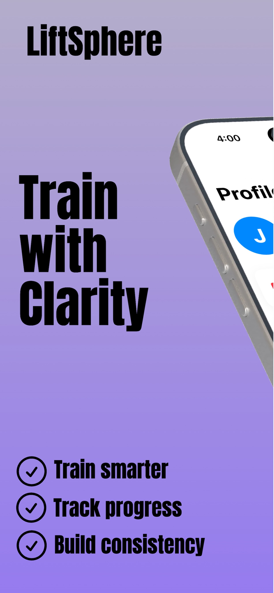
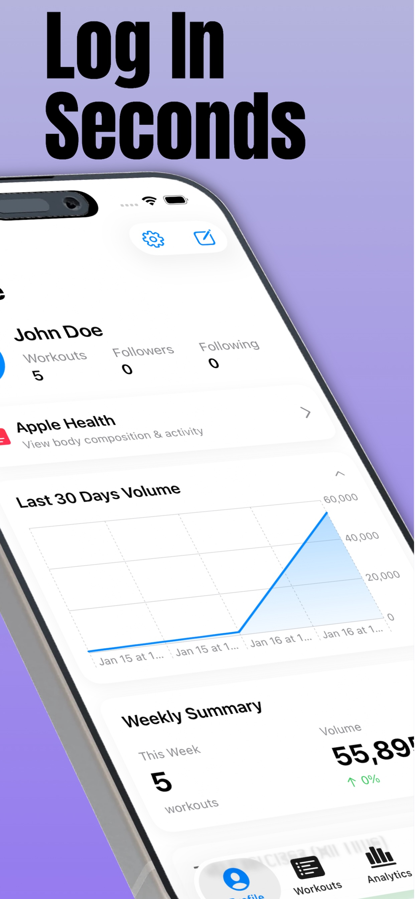
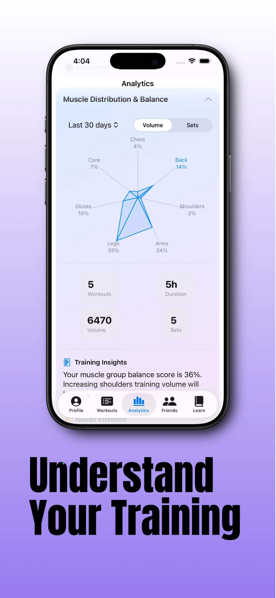
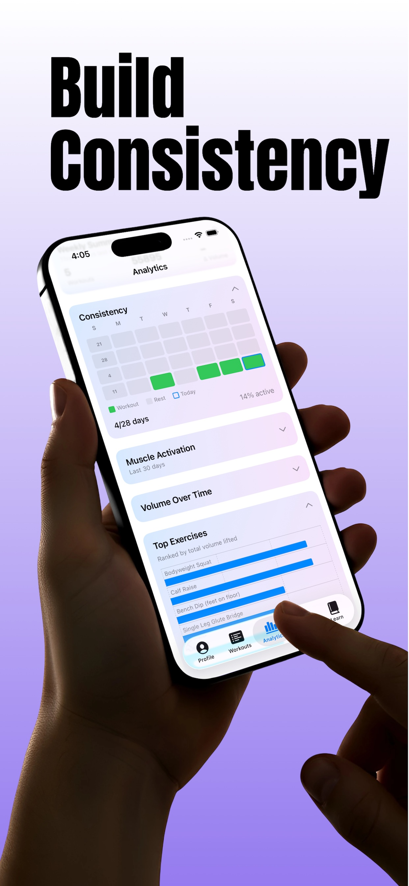
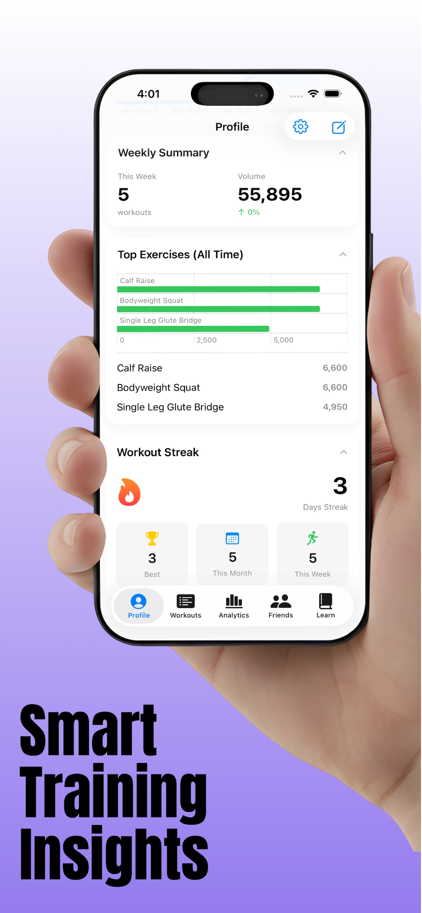

# LiftSphere

A free, ad free workout tracker built with SwiftUI.

LiftSphere started as a personal project to build a clean and focused workout logging experience without ads, subscriptions, or unnecessary friction. It is designed to help you log workouts, track progress, and stay consistent.

## Why I Built This

After experimenting with AI tools and shipping quickly across different domains, I wanted to build something simple and useful that I would personally use every day. LiftSphere is the result.

It focuses on clarity, speed, and ownership of your data.

## Features

- Log strength workouts
- Create custom exercises
- Track sets and reps
- Tabata workout support
- Workout export support
- Cloud sync using CloudKit
- Clean and distraction free interface

## Screenshots

  
  

---

## Smart Features

  
  
  

---

## Tech Stack

- SwiftUI
- SwiftData
- CloudKit
- iOS

## Getting Started

1. Clone the repository
2. Open the project in Xcode
3. Configure your own iCloud container in your Apple Developer account
4. Update signing settings with your team
5. Build and run on device or simulator

This repository does not include any API keys, private certificates, or credentials. You must configure your own services locally.

## Project Structure

- VinProWorkoutTracker contains the main app source
- Tests and UI tests are included
- HTML files are used for privacy policy hosting via GitHub Pages

## Contributing

This project is open source under the MIT license. Feel free to explore, fork, and experiment.

## License

MIT
